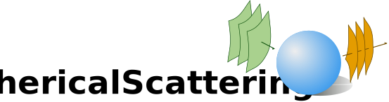

## Introduction

This package provides semi-analytical solutions to the scattering of time harmonic electromagnetic fields from spherical objects. 
To this end, series expansions are evaluated. Special care is taken to obtain accurate solutions down to the static limit.

##### Available incident fields:
- :heavy_check_mark: Plane wave
- :heavy_check_mark: Field of electric/magnetic ring current
- :heavy_check_mark: Field of electric/magnetic dipole
- :heavy_check_mark: TE/TM spherical vector waves

##### Available scattering objects:
- :heavy_check_mark: PEC sphere
- :hourglass_flowing_sand: PMC sphere
- :hourglass_flowing_sand: Dielectric sphere
- :hourglass_flowing_sand: Mulitlayer dielectric sphere

## Documentation

Here you can find the [documentation](https://HoBeZwe.github.io/SphericalScattering.jl/stable).