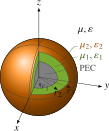

# General

The following conventions are employed for all excitations.

## Coordinate System

!!! info
    At the user interface a Cartesian basis is used for all coordinates and field components. Internally, spherical coordinates are used as well.

The employed coordinate system uses the following convention for the spherical coordinates.

```@raw html
<div align="center">

</div>
<br/>
```

```@raw html
<!---
<center>
<picture>
  <source media="(prefers-color-scheme: dark)" srcset="assets/SphereEx_white.svg" height="3000" align="middle">
  <source media="(prefers-color-scheme: light)" srcset="assets/SphereEx.svg" height="3000">
  
</picture>
</center>
--->
```

## Sphere Dimensions

!!! note
    In all of the following setups the sphere is embedded in a homogeneous background medium with permeability $\mu$ and permittivity $\varepsilon$ defined by [`Medium(ε, μ)`](@ref). The values [`μ0`](@ref) and [`ε0`](@ref)  are provided containing the free space values.


#### PEC Sphere

The perfectly electrically conducting (PEC) sphere has radius $r$ and is assumed to be located in the origin. It is defined by [`PECSphere`](@ref).
```@raw html
<div align="center">

</div>
<br/>
```


#### Dielectric Sphere

The dielectric sphere has radius $r$ and is assumed to be located in the origin. It is defined by [`DielectricSphere`](@ref). In addition to the embedding [`Medium(ε, μ)`](@ref) a filling [`Medium(εᵢ, μᵢ)`](@ref) with permeability $\mu_\mathrm{i}$ and permittivity $\varepsilon_\mathrm{i}$ has to be defined. 
```@raw html
<div align="center">

</div>
<br/>
```


#### Layered Dielectric Sphere

The layered dielectric sphere has radii $[r_1, r_2, \dots, r_N]$ and is assumed to be located in the origin. It is defined by [`LayeredSphere`](@ref). In addition to the embedding [`Medium(ε, μ)`](@ref) a vector of fillings [[`Medium(ε₁, μ₁)`](@ref), [`Medium(ε₂, μ₂)`](@ref), ..., [`Medium(εN, μN)`](@ref)] with permeability $\mu_n$ and permittivity $\varepsilon_n$ has to be defined.
```@raw html
<div align="center">

</div>
<br/>
```


#### Layered Dielectric Sphere with PEC Core

The layered dielectric sphere has radii $[r_1, r_2, \dots, r_{N+1}]$ and is assumed to be located in the origin. It is defined by [`LayeredSpherePEC`](@ref). In addition to the embedding [`Medium(ε, μ)`](@ref) a vector of fillings [[`Medium(ε₁, μ₁)`](@ref), [`Medium(ε₂, μ₂)`](@ref), ..., [`Medium(εN, μN)`](@ref)] with permeability $\mu_n$ and permittivity $\varepsilon_n$ has to be defined.
```@raw html
<div align="center">

</div>
```